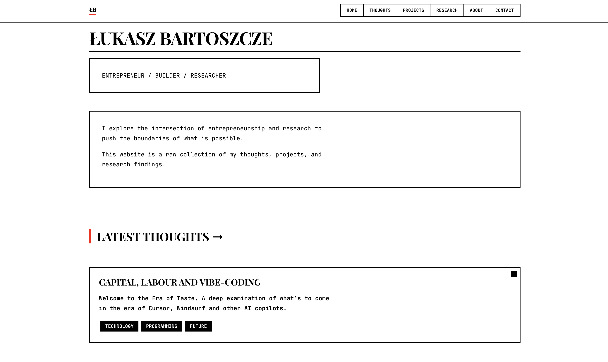
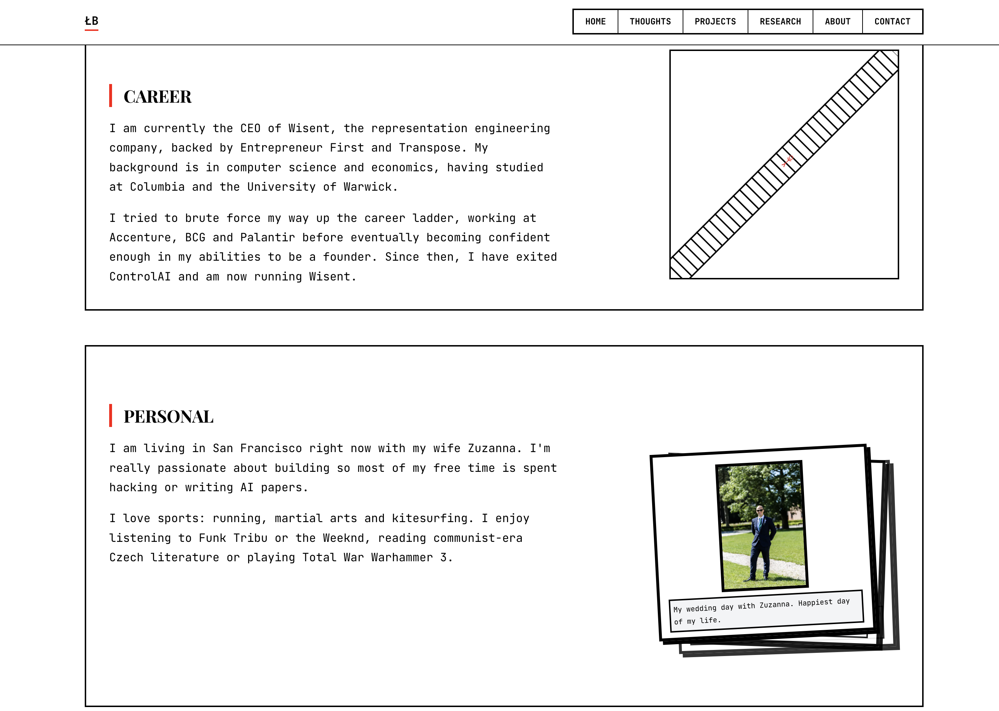

# Brutalist Personal Website

A personal website built with Next.js featuring a brutalist design aesthetic. This project serves as a personal portfolio and blog platform.

## Features

- Modern brutalist UI design
- Portfolio section for showcasing projects
- Blog/thoughts section for written content
- About and contact sections
- Admin dashboard for content management
- Responsive design for all devices

## Screenshots

Here are some screenshots of the website:





## Tech Stack

- **Framework**: [Next.js](https://nextjs.org) with App Router
- **Styling**: Tailwind CSS
- **Database**: Prisma ORM
- **Authentication**: Custom auth for admin panel

## Local Development

```bash
# Install dependencies
npm install
# or
yarn

# Set up your environment variables
cp .env.example .env
# (then edit .env with your credentials)

# Run the development server
npm run dev
# or
yarn dev
```

Open [http://localhost:3000](http://localhost:3000) with your browser to see the result.

## Project Structure

- `src/app/`: Next.js App Router components
- `src/components/`: Reusable UI components
- `brutalist/`: Brutalist design system components
- `prisma/`: Database schema and migrations
- `public/`: Static assets and project content

## Admin Dashboard

The site includes an admin dashboard for managing content:
- Thoughts/blog posts management
- Projects portfolio management
- Basic authentication

Access the admin dashboard at `/admin` (requires authentication).

## Deployment

The site is designed to be deployed on Vercel or any platform supporting Next.js deployments.

## License

[MIT](https://choosealicense.com/licenses/mit/)
